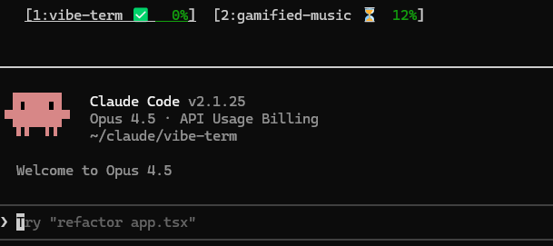

# vibe-term

Terminal HUD for managing Claude Code sessions.



## What It Does

vibe-term provides an always-visible HUD strip showing all your Claude Code sessions as tabs. At a glance you see which sessions are working, idle, or blocked, plus context window usage with stoplight colors.

The HUD stays visible at the top of your terminal while you work. Press `Alt+1` through `Alt+9` to instantly switch between sessions, or `Ctrl+H` to focus the HUD. Sessions spawned from vibe-term or running in external tmux panes are detected automatically.

## Installation

```bash
npm install -g vibe-term
```

## Prerequisites

- **Node.js 20+**
- **tmux** - Terminal multiplexer
- **Claude Code CLI** - Installed and configured

## Quick Start

```bash
vibe-term
```

This launches the TUI in a tmux session with the HUD strip at the top.

## Hook Setup Commands

vibe-term tracks session status via Claude Code hooks. Use these commands to configure hooks across your projects.

### setup

Install global hooks to `~/.claude/settings.json`:

```bash
vibe-term setup          # Install hooks with confirmation
vibe-term setup --yes    # Skip confirmation
vibe-term setup --json   # JSON output for scripting
```

### audit

Scan projects for hook conflicts:

```bash
vibe-term audit              # Scan all projects with Claude sessions
vibe-term audit --conflicts  # Show only projects with conflicts
vibe-term audit --json       # JSON output
```

### fix

Resolve hook conflicts by merging vibe-term hooks with existing project hooks:

```bash
vibe-term fix            # Preview changes (dry-run)
vibe-term fix --apply    # Apply fixes with backup
vibe-term fix /path      # Fix single project
vibe-term fix --json     # JSON output (requires --yes)
```

## Hook Workflow

1. **setup** installs global hooks that track session status (working/idle/blocked)
2. Project-level `.claude/settings.json` can override global hooks
3. **audit** detects projects with conflicting hooks
4. **fix** merges vibe-term hooks into project settings, preserving existing hooks

Typical workflow for new users:

```bash
vibe-term setup           # Install global hooks
vibe-term audit           # Check for conflicts
vibe-term fix --apply     # Resolve any conflicts
vibe-term                 # Launch TUI
```

## Keybindings

### Global (work anywhere in the tmux session)

| Key | Action |
|-----|--------|
| `Alt+1-9` | Switch to session by number |
| `Ctrl+H` | Focus the HUD pane |
| `Ctrl+\` | Detach from tmux session |

### HUD Pane (when HUD is focused)

| Key | Action |
|-----|--------|
| `j/k` or `↑/↓` | Navigate session list |
| `←/→` | Navigate tabs |
| `1-9` | Select session by number |
| `Enter` | Switch to selected session |
| `n` | Spawn new Claude session |
| `q` | Quit prompt (d=detach, k=kill) |
| `?` | Show help overlay |
| `x` | Dismiss error message |
| `Ctrl+C` | Exit (press twice to force) |

### Spawning Sessions

Press `n` in the HUD to spawn a new Claude session. Enter a directory path (tab completion supported) and press Enter.

## Troubleshooting

### tmux not found

**macOS:**
```bash
brew install tmux
```

**Debian/Ubuntu:**
```bash
sudo apt install tmux
```

**Other Linux:**
Use your distribution's package manager to install tmux.

### Permission errors on npm install -g

If you get EACCES permission errors during global install, configure npm to use a user-owned directory:

```bash
mkdir ~/.npm-global
npm config set prefix '~/.npm-global'
```

Add to your shell profile (~/.bashrc or ~/.zshrc):
```bash
export PATH=~/.npm-global/bin:$PATH
```

Alternatively, use [nvm](https://github.com/nvm-sh/nvm) which handles this automatically.

### WSL2 Notes

- Install tmux in your WSL distro: `sudo apt install tmux`
- If tmux behaves oddly (lag, rendering issues), restart WSL: `wsl.exe --shutdown`
- Some Windows Terminal versions may have rendering issues with the status bar

### Claude Code CLI not found

Ensure Claude Code is installed and `claude` is in your PATH:
```bash
which claude
```

If not found, follow the [Claude Code installation guide](https://docs.anthropic.com/en/docs/claude-code/installation).

## License

ISC
