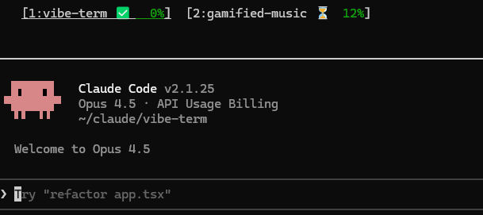

# vibe-term

[](https://github.com/ssugar/vibe-term/actions/workflows/ci.yml)
[](https://www.npmjs.com/package/vibe-term)
[](https://opensource.org/licenses/ISC)

Terminal HUD for managing Claude Code sessions.

## Demo



> An animated `asciinema` cast will replace this static screenshot once recorded.
> To record locally: `asciinema rec demo.cast`, upload, then embed via
> `[](https://asciinema.org/a/<id>)`.

## Why vibe-term

- **Single pane of glass** — every Claude Code session you have running is a tab in one always-visible HUD strip, not a forest of terminal windows.
- **Status at a glance** — colored indicators for _working / idle / blocked_ and a stoplight for context-window usage, driven by Claude Code's hook events.
- **No context switching** — `Alt+1`–`Alt+9` jumps to any session instantly; `Ctrl+H` focuses the HUD itself.
- **Plays nicely** — vibe-term's hooks merge into existing `.claude/settings.json` non-destructively, with backups, and the `audit` / `fix` commands keep that contract honest.

## Install

```bash
npm install -g vibe-term
```

### Prerequisites

- **Node.js 20+**
- **tmux** — terminal multiplexer
- **Claude Code CLI** — installed and configured

## Quick Start

```bash
vibe-term setup           # Install global hooks (~/.claude/settings.json)
vibe-term audit           # Check existing projects for hook conflicts
vibe-term fix --apply     # Merge vibe-term hooks into projects that need it
vibe-term                 # Launch the TUI
```

## Commands

vibe-term tracks session status via Claude Code hooks. The CLI commands manage that hook configuration across your global settings and per-project settings.

### setup

Install global hooks to `~/.claude/settings.json`:

```bash
vibe-term setup          # Install hooks with confirmation
vibe-term setup --yes    # Skip confirmation
vibe-term setup --json   # JSON output for scripting
```

### audit

Scan projects for hook conflicts:

```bash
vibe-term audit              # Scan all projects with Claude sessions
vibe-term audit --conflicts  # Show only projects with conflicts
vibe-term audit --json       # JSON output
```

### fix

Resolve hook conflicts by merging vibe-term hooks into existing project hooks:

```bash
vibe-term fix            # Preview changes (dry-run)
vibe-term fix --apply    # Apply fixes with backup
vibe-term fix /path      # Fix a single project
vibe-term fix --json     # JSON output (requires --yes)
```

### Hook workflow

1. `setup` installs global hooks that track session status (working / idle / blocked).
2. Project-level `.claude/settings.json` can override global hooks.
3. `audit` detects projects with conflicting hooks.
4. `fix` merges vibe-term hooks into project settings, preserving existing hooks (and writing a backup).

## Keybindings

### Global (work anywhere in the tmux session)

| Key       | Action                      |
| --------- | --------------------------- |
| `Alt+1-9` | Switch to session by number |
| `Ctrl+H`  | Focus the HUD pane          |
| `Ctrl+\`  | Detach from tmux session    |

### HUD pane (when HUD is focused)

| Key            | Action                                    |
| -------------- | ----------------------------------------- |
| `j/k` or `↑/↓` | Navigate session list                     |
| `←/→`          | Navigate tabs                             |
| `1-9`          | Select session by number                  |
| `Enter`        | Switch to selected session                |
| `n`            | Spawn new Claude session                  |
| `x`            | Kill selected session (with confirmation) |
| `q`            | Quit prompt (d=detach, k=kill)            |
| `?`            | Show help overlay                         |
| `Ctrl+C`       | Exit (press twice to force)               |

### Spawning sessions

Press `n` in the HUD to spawn a new Claude session. Enter a directory path (tab completion supported) and press Enter.

### Killing sessions

Press `x` on a selected session to terminate it. A confirmation prompt shows the session name — press `y` to confirm or `n` / `Escape` to cancel. This kills the tmux pane and cleans up session state files. External sessions (not spawned by vibe-term) cannot be killed.

## Troubleshooting

### tmux not found

**macOS:**

```bash
brew install tmux
```

**Debian/Ubuntu:**

```bash
sudo apt install tmux
```

**Other Linux:** use your distribution's package manager.

### Permission errors on `npm install -g`

If you get `EACCES` errors during global install, configure npm to use a user-owned directory:

```bash
mkdir ~/.npm-global
npm config set prefix '~/.npm-global'
```

Add to your shell profile (`~/.bashrc` or `~/.zshrc`):

```bash
export PATH=~/.npm-global/bin:$PATH
```

Alternatively, use [nvm](https://github.com/nvm-sh/nvm), which handles this automatically.

### WSL2 notes

- Install tmux in your WSL distro: `sudo apt install tmux`
- If tmux behaves oddly (lag, rendering issues), restart WSL: `wsl.exe --shutdown`
- Some Windows Terminal versions may have rendering issues with the status bar

### Claude Code CLI not found

Ensure Claude Code is installed and `claude` is in your PATH:

```bash
which claude
```

If not found, follow the [Claude Code installation guide](https://docs.anthropic.com/en/docs/claude-code/installation).

## Contributing

Contributions are welcome. See [CONTRIBUTING.md](./CONTRIBUTING.md) for the dev loop (clone → install → `npm run dev` → `npm test`), lint/format expectations, and commit-message conventions.

## License

ISC
